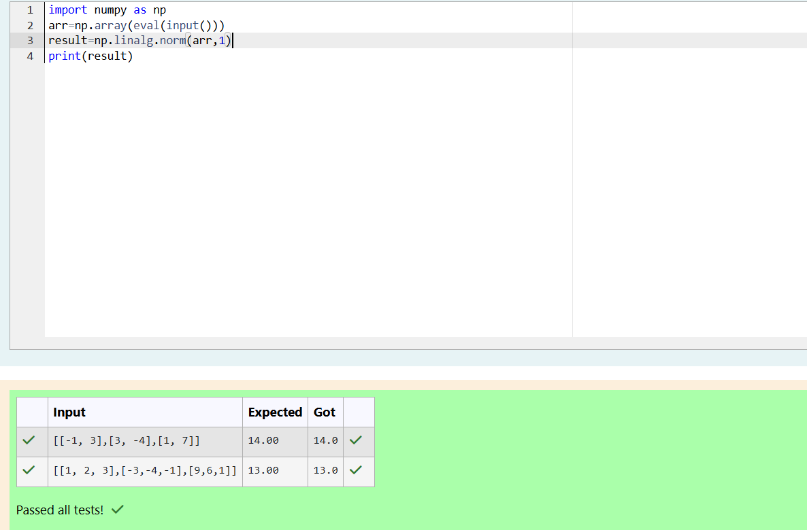
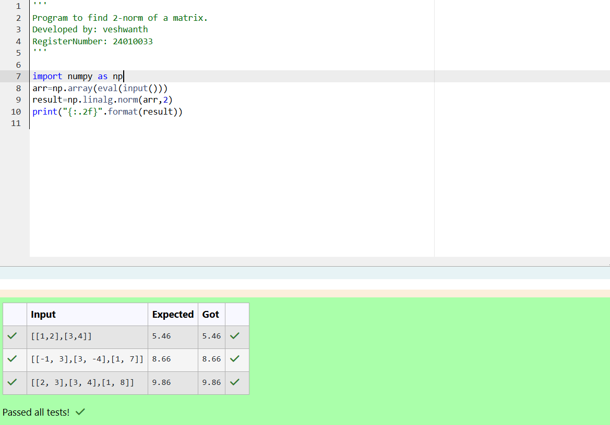
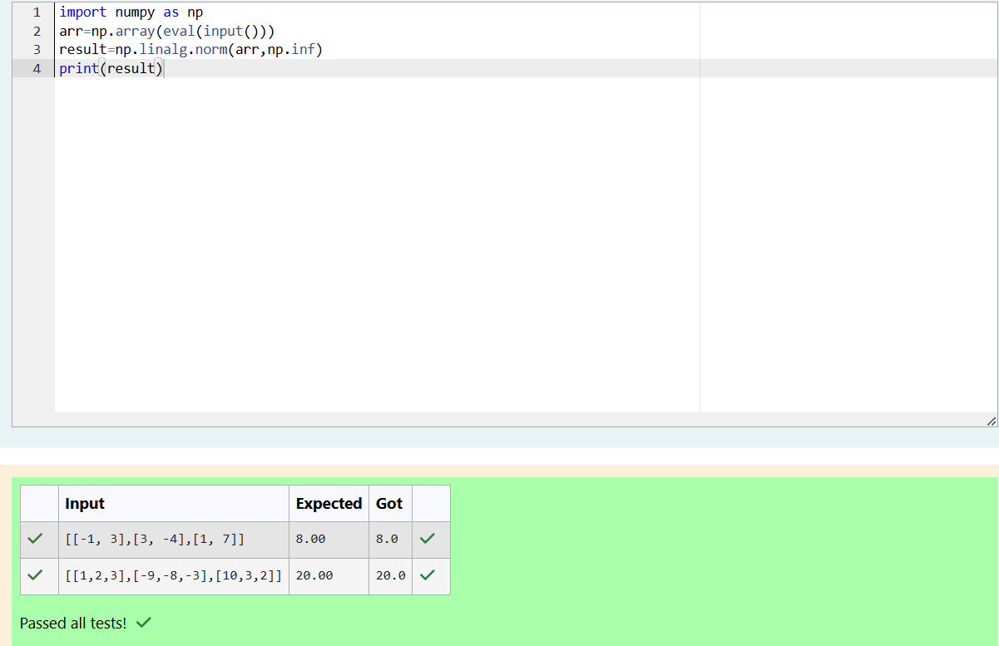

# Norm of a matrix
## Aim
To write a program to find the 1-norm, 2-norm and infinity norm of the matrix and display the result in two decimal places.
## Equipment’s required:
1.	Hardware – PCs
2.	Anaconda – Python 3.7 Installation / Moodle-Code Runner
## Algorithm for 1-Norm:
	1. Get the input matrix using np.array()   
    2. Find the 1-norm of the matrix using np.linalg.norm()
	3. Print the norm of the declaring variable (result) to get the output.

## Algorithm for 2-Norm:
    1. Get the input from the user in the form matrix using (np.array) first declare variable(arr).
    2. First input the variable (result) use the inbuilt function of numpy of linalg.norm to compute the 2-norm for the matrix.
    3. print the variable(result) to get the output.
## Algorithm for infinity norm:
	1.Get the input from the user in the form matrix using (np.array) first declare variable(arr).
    2. First input the variable (result) use the inbuilt function of numpy of linalg.norm inside the bracket(arr,np.inf)to compute the norm for the matrix.
    3. print the variable(result) to get the output.


## Program:
```Python
# Register No:24010033
# Developed By:veshwanth
# 1-Norm of a Matrix
import numpy as np
arr=np.array(eval(input()))
result=np.linalg.norm(arr,1)
print(result)


# 2-Norm of a Matrix
'''
Program to find 2-norm of a matrix.
Developed by: veshwanth
RegisterNumber: 24010033
'''

import numpy as np
arr=np.array(eval(input()))
result=np.linalg.norm(arr,2)
print("{:.2f}".format(result))


# Infinity Norm of a Matrix
import numpy as np
arr=np.array(eval(input()))
result=np.linalg.norm(arr,np.inf)
print(result)


```
## Output:
### 1-Norm of a Matrix


### 2-Norm of a Matrix


### Infinity Norm of a Matrix


## Result
Thus the program for 1-norm, 2-norm and Infinity norm of a matrix are written and verified.
